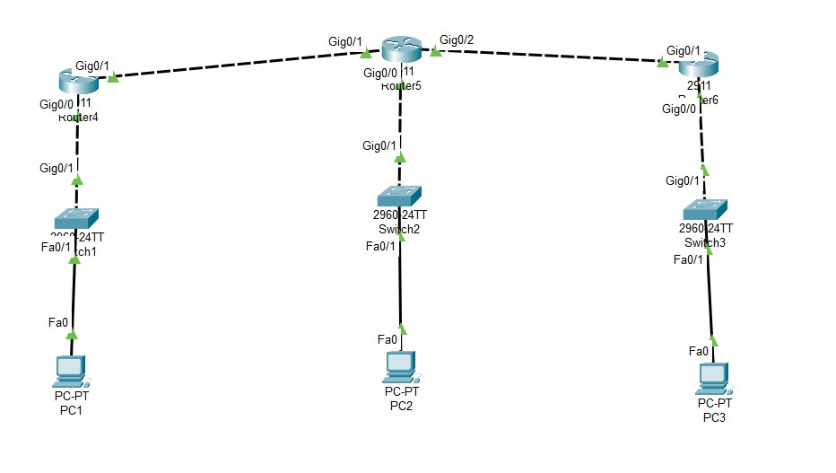

# CCNA Static Routing Lab

This project demonstrates a basic static routing scenario using three routers, three switches, and three end devices. It helps beginners understand how to manually configure routes in Cisco routers using Packet Tracer.

## 🔧 Devices Used
- 3 Routers (R1, R2, R3)
- 3 Switches
- 3 PCs

----

## 🧠 Objectives
- Configure IP addressing on routers and PCs
- Enable connectivity between separate networks via static routing
- Verify network reachability with `ping`

----

## 🌐 IP Addressing Scheme

| Network      | Subnet         | Router IPs           | PC IPs            |
|--------------|----------------|----------------------|-------------------|
| R1 - R2 Link | 10.0.12.0/30   | R1: 10.0.12.1, R2: 10.0.12.2 | - |
| R2 - R3 Link | 10.0.23.0/30   | R2: 10.0.23.1, R3: 10.0.23.2 | - |
| LAN 1        | 192.168.1.0/24 | R1: 192.168.1.1      | PC1: 192.168.1.10 |
| LAN 2        | 192.168.2.0/24 | R2: 192.168.2.1      | PC2: 192.168.2.10 |
| LAN 3        | 192.168.3.0/24 | R3: 192.168.3.1      | PC3: 192.168.3.10 |

----

## 🖼️ Photos

  

----

## ✅ Result
All PCs can ping each other using statically configured routes on the routers.

> ⚠️ License Notice:
> This project was previously licensed under [MIT](LICENSE). As of 2025-07-04, it is now licensed under [Apache 2.0](LICENSE).
